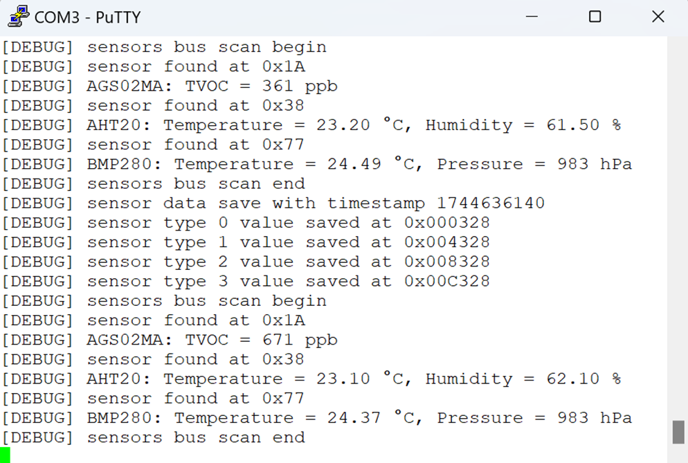
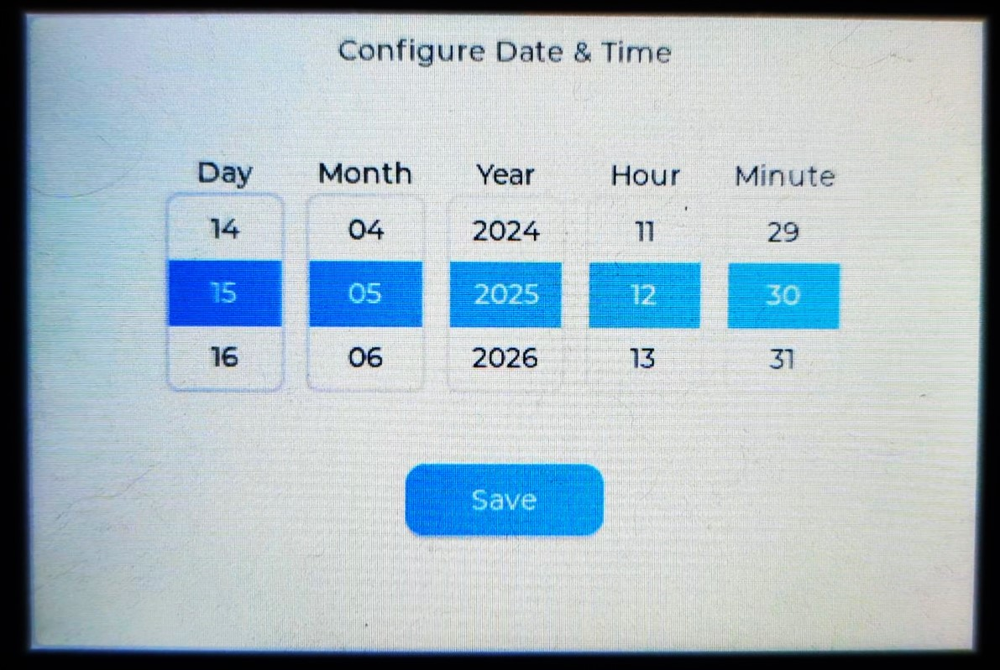
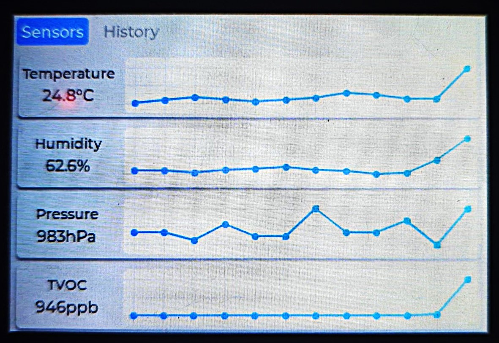
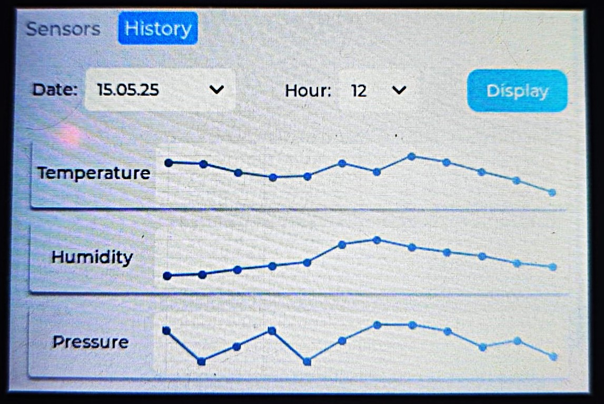

# 📈 Peripheral Sensors Readings Monitoring System

Flexible peripheral sensors readings monitoring system based on STM32 and FreeRTOS with an LVGL-based touchscreen UI.

## 📃 Tech Stack

* **MCU**: STM32F767ZI (NUCLEO dev board)
* **RTOS**: FreeRTOS
* **Peripherals**: I2C (sensors), SPI (screen, flash), UART (logging), DMA, RTC
* **GUI Library**: LVGL 9.2
* **Toolchain**: STM32CubeMX, GCC + Make
* **Debugging**: ST-Link
* **Language**: C

## 🗂️ Project Structure

```
root/
├── module/         - Main logic modules
├── target/         - STM32CubeMX projects, genarated code
├── third-party/    - Third-party libraries, e.g. LVGL
├── makefile
├── LICENSE.md
└── README.md
```

## 🛠️ Getting Started

### Build

Clone the repository:

```
git clone https://github.com/AOSity/sensors-monitor.git
cd sensors-monitor
git submodule update --init --recursive
```

Build:
```
make
```

Flash:
```
make flash
```

## 💻 Logging

Connect via UART or USB and use a terminal app (e.g PuTTY)



## 📸 GUI

Date and Time configuration (saved to RTC)



Sensors screen, real-time readings and last hour changes




History screen, reads and display historic data from flash



## 🪛 Hardware Setup

* **Board**: STM32 Nucleo-F767ZI
* **Sensors**: AHT20 (I2C), BMP280 (I2C), AGS02MA (I2C)
* **Screen**: Display ST7796S 480x320 (SPI), Touch FT6336U (I2C)
* **Flash**: W25QXX (SPI)


